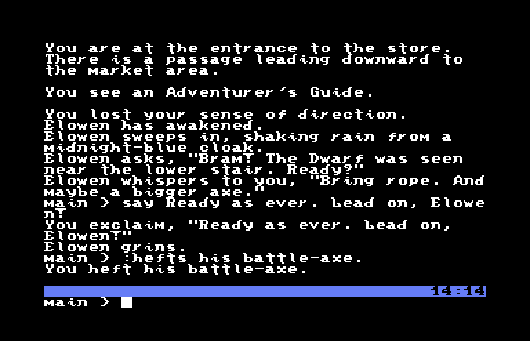
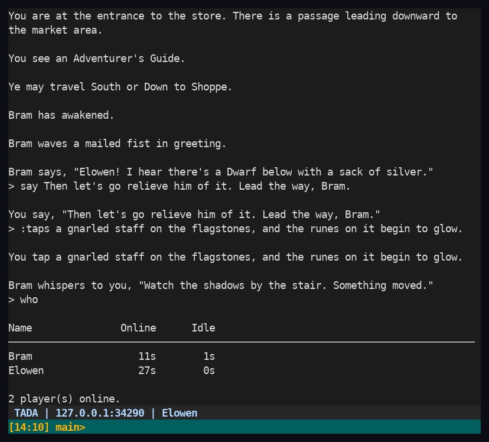
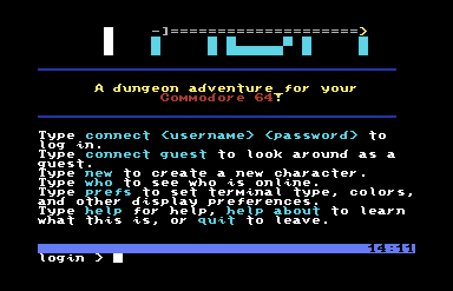
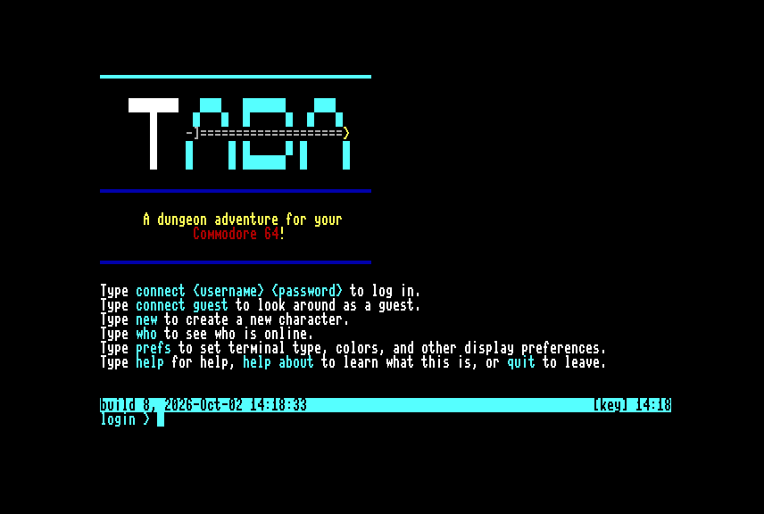
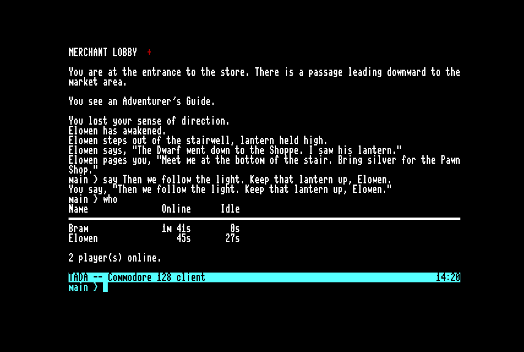
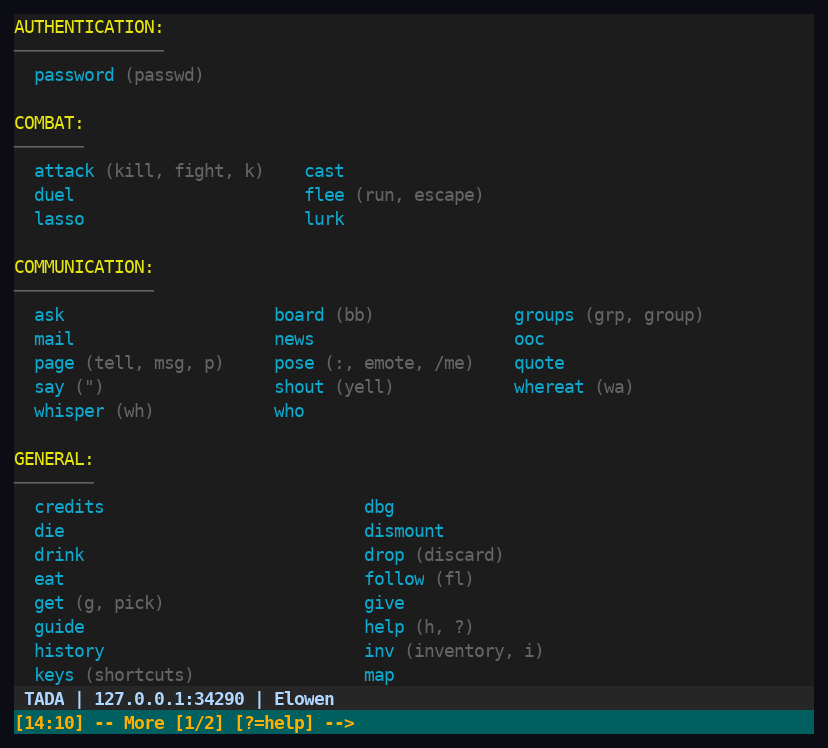
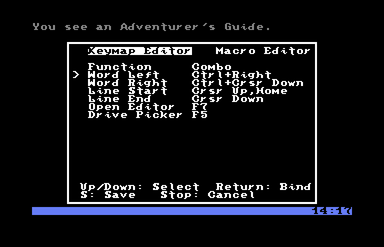
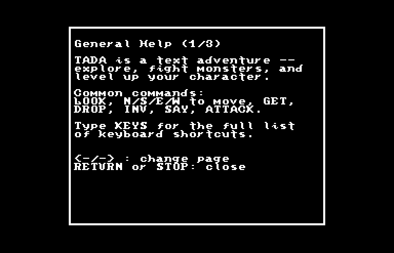

# TADA — Totally Awesome Dungeon Adventure

**A 1980s single-player BBS dungeon crawl, rebuilt as a real multiplayer game — playable from a modern terminal, a Commodore 64, or a Commodore 128.**

  
  

(Work in progress, in alpha testing. Help wanted!)

## What is TADA?

TADA is a re-implementation of **"The Land of Spur"** (TLoS), an Apple BBS door game from 1986–1994. In Spur you dialed in, explored a dungeon, fought monsters, recruited allies, and saved your character for next time. And you did it **alone**: a BBS had one phone line, so only one adventurer was ever in the dungeon at a time. Other players existed only as names on the high-score list, notes on the message board, or a statue left where someone died.

TADA asks a simple question: *what if everyone was in the dungeon at once?*

The approach has three parts:

1. **Keep Spur's soul.** Rooms, monsters, items, spells, guilds, allies, and flavor text are ported from the original GBBS BASIC source (`SPUR-code/`), often routine by routine. The room data comes from Spur's own compressed message-database files. When in doubt, TADA does what Spur did. It only departs from Spur to fix obvious BASIC-era limits, such as ACOS's 16-bit integer ceiling (see [A bit of history](#a-bit-of-history)).
2. **Make it truly multiplayer.** A Python asyncio server keeps one shared world. Players see each other arrive, talk, fight side by side, duel, trade, and lead each other through the dungeon in real time.
3. **Borrow from the MUCKs and the BBSes.** The social layer comes from **Fuzzball MUCK**: posing, paging, whispering, `wa`, pronoun substitution, and named page groups. The community layer comes from the **BBS scene**: a threaded multi-SIG message board, private mail, news, and a dot-command line editor ported from **Image BBS** for the Commodore 64.

And because this all started on a Commodore, **the Commodore is a first-class client**. There's a native 6502 client for the C64 and C128 that talks to the server over a SwiftLink cartridge. It can even stream SID music from the server while you play.

## A quick tour

| | |
|:---:|:---:|
|  |  |
| **Commodore 64** login screen, PETSCII logo and all. | **Commodore 128**, native 80-column mode on the VDC chip. |
|  |  |
| Say, pose, page, and `who` on the 128. The other player is on a different client entirely. | The **Python terminal client**'s color-coded command reference. |
|  |  |
| The C64 client's **keymap & macro editor** (F7), a native popup loaded as an overlay from disk. | The server can open native C64 popups too, like this `guide` help window. |

*All screenshots are real sessions against a TADA server: VICE for the C64/C128, and the actual `tada_client.py` for the terminal client.*

## Features

### A real multiplayer dungeon

* **One shared, persistent world.** Everyone moves through the same rooms at the same time. You see other players arrive, leave, fall asleep, and wake up. Items you drop stay where you left them for others to find.
* **Fight together, or against each other.** Group up with other players and fight side by side, or settle a grudge with a **live player-vs-player duel**. Duels have initiative, class abilities (wizards cast, druids heal), win/loss records, a battle log, and a forfeit if someone disconnects mid-fight. Under-handed players can even steal from someone standing in the same room.
* **Guild Follow / FOLLOW ME.** Guild members can lead each other through the dungeon. A leader types `FOLLOW ME` and their guildmates follow them room to room.
* **A world-shared thief.** The Dwarf roams level 1 robbing *everyone*. Hunt him down and you get his whole hoard, including everything he stole from every other player.
* **Allies and parties.** Recruit, equip, and feed NPC allies who fight with you. Deploy them as Point Man, Flank Guard, or Rear Guard, or lurk behind them and fire over their shoulders.
* **Death that matters.** You can be knocked unconscious, you have honor and alignment to lose, and fallen adventurers leave statue memorials behind.

### Borrowed from Fuzzball MUCK

TADA's social commands will feel familiar to anyone who's spent time on a MU\*:

* `say` (or `"`), `pose` (or `:`, `/me`), `whisper`, `shout`, and `ooc` for out-of-character asides.
* `page` sends private messages anywhere in the dungeon, to one person or several.
* `groups` saves named lists of players to target with `page` and `whisper`.
* `who` shows online and idle times, and `wa` (WhereAt) shows where everyone is, including a room-by-room population view.
* **%-token pronoun substitution** (`%n`, `%s`, `%o`, `%p`, `%r`…), so one line of game text reads correctly for every player.
* A personal `quote`, `examine`, command `history`, and in-game hot reloading of command modules for admins, so the server rarely needs to restart.

### Born on a BBS

* **Threaded message board** with multiple Special Interest Groups (SIGs), optional SIG intro screens, and "read all new" / "scan all new" across every board.
* **Private mail** with replies, and a **news** feed that announces things like new guild recruits.
* **A full-featured line editor ported from Image BBS** (`server/text_editor.py`), the BBS program many C64 sysops ran. It has the classic dot-commands: `.L`ist, `.E`dit, `.D`elete, `.I`nsert, `.J`ustify (left/center/right/expand/pack/indent), `.F`ind, search & replace, `.B`order, line ranges like `1-4,6,9-15`, and `.S`ave. Unsaved work survives a server shutdown and can be resumed later.
* **Login-time tips**, a "you last connected on…" welcome, and paginated `-- More --` output tuned to each player's screen size.

### Spur's game, intact

* **Eight dungeon levels** converted from Spur's original data, up to the 365-room Forest of Canolbarth.
* **Races, classes, and rolled stats** (4d6, drop the lowest), with honor and alignment that depend on your race.
* **Five guilds** (Civilians, Iron Fist, Sword, Claw, and Outlaws), each with its own headquarters.
* **Combat and magic**: weapons with real class and race suitability, armor and shields that wear down, spells, monsters that only fall to one specific weapon, and prayers to the Spirit of the Dungeons.
* **Horses** to lasso, name, ride, and fight from (they sometimes bolt).
* **Virtual locations**: the Bar (with its thugs and a blue djinn), the Shoppe, the Pawn Shop, the elevator, Gollum's riddles, and more, plus an actual way to win and escape the dungeon.

### One server, every kind of terminal

The server renders the same game output for each connection type: **PETSCII** for Commodores, **ANSI color** for modern terminals, an ASCII mode for gadget's ASCII terminal on a real C64, or **plain text**. `prefs` sets client-type presets, screen size, colors, date/time formats, and more. Game text uses one markup language (`|yellow|`, `|command|`…) that each terminal type turns into its own colors.

## The clients

### Commodore 64

A native 6502 client (`assembly-language/client/`) that talks to the server over a **SwiftLink** RS-232 cartridge at 38,400 baud, with an NMI-driven receive buffer.

* **SID music streaming.** The server runs a real `.sid` tune's 6502 code on an emulated CPU (`server/sid_engine/`, using py65), records every SID register write, and streams those frames down the same connection as the game text. The client plays them back from an IRQ, in the background, so you can keep typing while music plays. Try `play ultima3 5`.
* **KERNAL-free, double-buffered screen output** with a status bar and clock, and a two-row input line with its own line editor.
* **3-key rollover keyboard scanning**, replacing the stock KERNAL scan, plus a **keymap & macro editor** (F7). Bind any key combination to an editing action or a text macro, and save it to `TADA64.CFG` on disk.
* **Native popups loaded as overlays from disk**, so no single load gets too big: Video Settings (border/background colors, cursor blink speed, single/double borders), the help/keys/credits guide, the keymap editor, a disk-drive picker that scans the serial bus, and an in-game **PETSCII banner editor** for drawing 40×25 screens that the server stores.
* RUN/STOP at "Connecting…" puts you in offline mode.

See [`assembly-language/client/CLIENT_MECHANICS.md`](assembly-language/client/CLIENT_MECHANICS.md) for the gory details.

### Commodore 128

A native-mode C128 client built from the same code base:

* **80 columns on the 8563 VDC**, or 40 columns on the VIC-II.
* **Scrollback history kept in VDC RAM** (it detects whether you have 16K or 64K of VDC RAM).
* Its own keymap editor (`KEYMAP128.CFG`), the drive picker, and SwiftLink networking.

### Python terminal client

`server/tada_client.py` is a [prompt_toolkit](https://python-prompt-toolkit.readthedocs.io/) client for any modern terminal. It has a scrollable output pane (PgUp/PgDn), a status bar, and a dedicated input line, so incoming messages never garble what you're typing. It also has optional session logging. Ready-made bundles for Linux, macOS, and Windows (no Python install needed) are on the [Releases page](https://github.com/Pinacolada64/TADA/releases) as `client-v*` tags. See [`server/BUILD-CLIENT.md`](server/BUILD-CLIENT.md). `server/simple_client.py` is a lighter `colorama`-based alternative.

Out of the box, `tada_client.py` connects to the public alpha server. `connect guest` lets you look around without an account, and `new` creates a character.

## For sysops and dungeon masters

* An invite-based account system with guest logins, bans, and password management.
* `editplayer`, an interactive player editor modeled on the original C64 one, plus a monster editor and live server `config`.
* Log browsing (system log, statue memorials, battle log), `teleport`, item-location reports, and nightly guild maintenance.
* Graceful shutdown that saves players' editor work, and hot reloading of command modules.
* A printable map generator for every level (`server/tools/gen_level_maps.py`).
* A large pytest suite (4,000+ tests, including end-to-end tests over real sockets), plus scripted `bot_client.py` sessions in `server/tools/` for exploratory and regression testing.

## Server architecture

`server/` is an asyncio-based Python game server and its clients, replacing TLoS's single-player GBBS BASIC model with real multiplayer:

* `simple_server.py`/`net_server.py` run the async server (connection handling, invite/login handshake); `net_client.py`/`net_common.py` define the shared wire protocol (JSON-serialized messages for modern clients, a PETSCII byte stream for Commodores).
* Player commands live in `commands/` (dozens of modules--movement, combat, loot, prayer, admin, preferences, etc.) dispatched through a central command processor.
* Gameplay systems are split into their own packages: `combat/` (the fight engine), `ally_events/` (ally silver-finding, hunger, death-saves, farewells--ported line-by-line from named SPUR BASIC routines), `encounters/`, `logon_events/`, `quests/`, `guild_hq/`, `shoppe/`, `bar/`, `street/`, plus `board/`, `mail.py`, and `news.py` for BBS-style social features.
* `characters.py`, `player.py`, and `base_classes.py` define the character/stat model (races, classes, alignment, size); room and item data live as `level_*.json`/`objects.json`/`monsters.json`, converted from SPUR's original compressed GBBS message-database files.
* `terminal.py` translates the same game output per client type--PETSCII, ANSI, or plain text--so one server serves every client above.
* Newer subsystems: `sid_engine/` (streams SID music to the C64 client), `petscii_editor/` (in-game PETSCII banner/screen editor), and `text_editor.py` (the Image BBS-style line editor).

## A bit of history

TLoS was written in a scripting language called _Advanced Communications Operating System_ (ACOS). It had limitations and quirks, as any programming language does. One such quirk is that by default, it can only handle two-byte signed integers between `-32768` and `+32767`. Naturally, this is a bit restrictive when dealing with adventure game statistics such as the amount of money carried upon your person, or similar things. (There is a cumbersome, repeated workaround in the code for this: splitting large values into two bytes/variables of most- and least-significant multiples of 1000.) The server-side rewrite addresses this with ordinary Python integers, and the original C64 client work (see `text-listings/` below) addressed it with 24-bit values of `1`-`16,777,216`--a much more comfortable range--using routines written by FuzzyFox of "AutoGraph," a graphics converter for the C64, fame.

Before the Python server, TADA was a modBASIC program for the C64 itself. Those modules live on in `text-listings/` as reference and source material.

## Directory structure

`SPUR-code/`: Modules for TLoS.

`SPUR-data/`: Data files for study, part of TLoS.

`assembly-language/`: C64 6510 assembly projects, including the TADA C64 and C128 clients (`assembly-language/client/`), the parser, works in progress, and code tests.

`graphics/`: Maps and the screenshots used in this README.

`programming-notes/`: Notes on both TLoS and TADA.

`scripts/`: Build, automation, and test scripts for both M$-DO$ and Linux.

`server/`: Python client and server, a work in progress. Help wanted.

`text-listings/`: The original C64/modBASIC TADA modules, from before the Python server rewrite--kept for reference and as source material for porting flavor text and game logic. See [text-listings/README.md](text-listings/README.md) for a breakdown of its subdirectories and the C64 assembly language routines behind it.

`text/`: Text captures from TLoS, miscellaneous notes.

## Want to play the original game?

It's telnettable: telnet://dura-bbs.net:6359

[Screenshots of the game](https://www.mobygames.com/game/37226/land-of-spur/screenshots/apple2/) are available on MobyGames.

## Credits

The Land of Spur was written by Greg W. Davis, Skip Thompson (Trajan), and Gene Buckle (geneb). TADA's porting and enhancements are by Ryan Sherwood (Pinacolada) and Jonathan Herr (DracoSilv), with assembly language help from FuzzyFox and many others. Type `credits` in-game for the full list. And of course, there's the undeniable influence of MUCKs… Feeps 4-ever!
